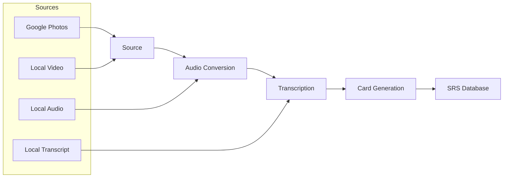

## Pipeline Flow

CookingAuto processes content through a modular pipeline with four main stages:



## Entry Points

The pipeline supports multiple entry points depending on your source material:

| Source | Entry Point | Modules Executed |
|--------|-------------|------------------|
| Google Photos date | `pnpm start -m cooking -d 2024-01-15` | All 4 stages |
| Local video file | `--video-file ./video.mp4` | Audio → Transcription → Cards |
| Local audio file | `--audio-file ./audio.mp3` | Transcription → Cards |
| Local transcript | `--transcript-file ./transcript.md` | Cards only |

## Module Selection

The `buildModuleList()` function in `src/commands/generate.ts` determines which modules to run:

```typescript
function buildModuleList(options: CliOptions): PipelineModule[] {
  if (options.transcriptFile) {
    return [];  // Skip to card generation
  }
  if (options.audioFile) {
    return [transcribeModule];
  }
  if (options.videoFile) {
    return [videoToAudioModule, transcribeModule];
  }
  // Default: full pipeline
  return [
    googlePhotosSourceModule,
    videoToAudioModule,
    transcribeModule,
  ];
}
```

## Key Design Principles

<CardGroup cols={2}>
  <Card title="Immutable Context" icon="lock">
    Each module receives a readonly context and returns a new context with updated fields. No mutation.
  </Card>
  <Card title="Fail-Fast Validation" icon="triangle-exclamation">
    All module prerequisites are validated before any execution begins.
  </Card>
  <Card title="Skip Conditions" icon="forward">
    Modules can define `shouldSkip()` to avoid reprocessing existing outputs.
  </Card>
  <Card title="Dependency Injection" icon="syringe">
    No global state. All dependencies passed through context.
  </Card>
</CardGroup>

## Context Threading

The `PipelineContext` accumulates state as it flows through modules:

```typescript
// Initial context
{ modeConfig, outputDirectory, transcriptionEngine }

// After Google Photos module
{ ...prev, videoPath: "/output/video/cooking.mp4", oauth2Client }

// After Audio module
{ ...prev, audioPath: "/output/audio/cooking.mp3" }

// After Transcription module
{ ...prev, transcriptPath: "/output/transcripts/cooking.md" }
```

## Directory Structure

```
output/
├── video/              # Downloaded videos
├── audio/              # Converted audio files
├── transcripts/        # Transcription output
└── cards/              # Card database (JSON)
```

## Next Steps

<CardGroup cols={2}>
  <Card title="Pipeline Deep Dive" icon="diagram-project" href="/architecture/pipeline">
    Understand PipelineModule and PipelineContext
  </Card>
  <Card title="Immutability Patterns" icon="lock" href="/architecture/immutability">
    How immutability is enforced
  </Card>
</CardGroup>
