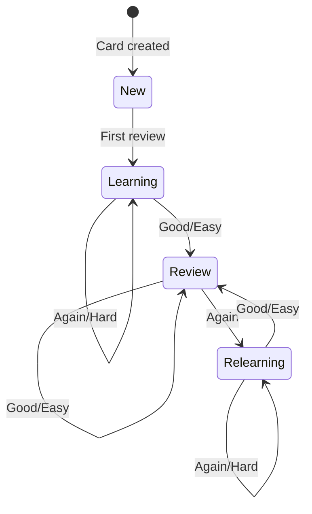

## Synopsis

```bash
pnpm start review [options]
```

Launch an interactive terminal-based review session for due flashcards.

## Options

| Option | Type | Default | Description |
|--------|------|---------|-------------|
| `-l, --limit <number>` | number | All due | Maximum cards to review |

## Examples

```bash
# Review all due cards
pnpm start review

# Review up to 20 cards
pnpm start review -l 20

# Quick 10-card session
pnpm start review --limit 10
```

## Review Interface

Each card is displayed in the terminal:

```
┌─────────────────────────────────────────────────┐
│ Card 1/15                           [technique] │
├─────────────────────────────────────────────────┤
│                                                 │
│   Quelle est la technique pour attendrir       │
│   la viande avant la cuisson?                  │
│                                                 │
│   Press SPACE to reveal answer...              │
│                                                 │
└─────────────────────────────────────────────────┘
```

After revealing:

```
┌─────────────────────────────────────────────────┐
│ Card 1/15                           [technique] │
├─────────────────────────────────────────────────┤
│                                                 │
│   Le marinage dans un acide (citron,           │
│   vinaigre, vin) pendant 2-24h, ou             │
│   l'utilisation d'un attendrisseur             │
│   mécanique qui brise les fibres.              │
│                                                 │
│   Rate: [1] Again  [2] Hard  [3] Good  [4] Easy│
│                                                 │
└─────────────────────────────────────────────────┘
```

## Rating Scale

| Key | Rating | When to Use |
|-----|--------|-------------|
| `1` | Again | Completely forgot, need immediate re-review |
| `2` | Hard | Recalled with significant difficulty |
| `3` | Good | Recalled with normal effort |
| `4` | Easy | Recalled instantly, felt effortless |

<Tip>
Be honest with ratings. The FSRS algorithm optimizes retention based on accurate feedback. Overrating cards leads to forgetting.
</Tip>

## FSRS Scheduling

After each rating, FSRS updates the card's:
- **Stability** - How long until next review
- **Difficulty** - How hard the card is for you
- **Due date** - When to review next

See [FSRS Scheduling](/srs/scheduling) for algorithm details.

## Session Summary

After completing or exiting (Ctrl+C):

```
Session Summary
───────────────────────────────
Reviewed:  15 cards
  Again:   2 (13%)
  Hard:    3 (20%)
  Good:    8 (53%)
  Easy:    2 (13%)

Next due: 5 cards tomorrow
```

## Keyboard Controls

| Key | Action |
|-----|--------|
| `Space` | Reveal answer |
| `1-4` | Rate card |
| `Ctrl+C` | Exit session (saves progress) |
| `q` | Quit review |

## State Transitions

Cards move through states based on ratings:



## Database Updates

Review progress is saved immediately after each card. If you exit mid-session:
- Completed ratings are preserved
- Remaining cards stay due
- Session can be resumed later
