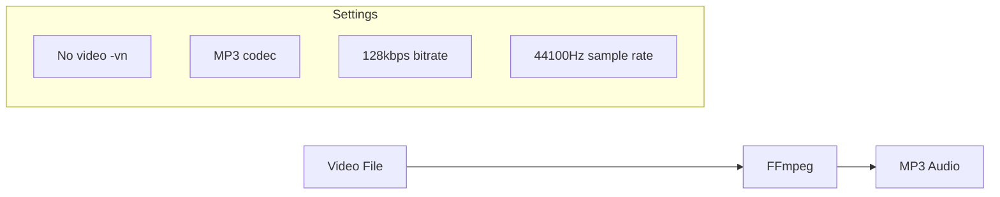

## Overview

FFmpeg converts video files to MP3 audio for transcription. This is a required step when starting from video sources.

## Installation

```bash
# macOS
brew install ffmpeg

# Ubuntu/Debian
sudo apt install ffmpeg

# Windows (chocolatey)
choco install ffmpeg

# Verify installation
ffmpeg -version
```

## Conversion Process



## Implementation

```typescript
// src/processing/ffmpeg.ts

import { spawn } from "child_process";

export async function convertToAudio(
  videoPath: string,
  audioPath: string
): Promise<void> {
  const args = [
    "-i", videoPath,           // Input file
    "-vn",                     // No video output
    "-acodec", "libmp3lame",   // MP3 codec
    "-ab", "128k",             // 128 kbps bitrate
    "-ar", "44100",            // 44.1 kHz sample rate
    "-y",                      // Overwrite output
    audioPath,                 // Output file
  ];
  
  await new Promise<void>((resolve, reject) => {
    const process = spawn("ffmpeg", args);
    
    process.on("close", (code) => {
      if (code === 0) resolve();
      else reject(new Error(`FFmpeg exited with code ${code}`));
    });
    
    process.on("error", reject);
  });
}
```

## FFmpeg Arguments

| Argument | Purpose |
|----------|---------|
| `-i <path>` | Input file path |
| `-vn` | Disable video output |
| `-acodec libmp3lame` | Use LAME MP3 encoder |
| `-ab 128k` | Audio bitrate (128 kbps) |
| `-ar 44100` | Sample rate (44.1 kHz) |
| `-y` | Overwrite without asking |

## Quality Settings

The defaults are optimized for speech transcription:

| Setting | Value | Reason |
|---------|-------|--------|
| Bitrate | 128 kbps | Sufficient for speech |
| Sample Rate | 44.1 kHz | Standard audio quality |
| Channels | Stereo (preserved) | Maintains speaker separation |

<Note>
Higher bitrates don't improve transcription quality for speech content.
</Note>

## Output Location

Audio files are saved in the output directory:

```
output/
├── video/
│   └── 2024-01-15_cooking.mp4
└── audio/
    └── 2024-01-15_cooking.mp3  ← FFmpeg output
```

## Why spawn() vs exec()?

```typescript
// ❌ exec() - vulnerable to command injection
exec(`ffmpeg -i "${videoPath}" ...`);

// ✅ spawn() - arguments are passed safely
spawn("ffmpeg", ["-i", videoPath, ...]);
```

`spawn()` passes arguments as an array, preventing shell injection attacks if paths contain special characters.

## Skip Condition

The video-to-audio module skips if output already exists:

```typescript
shouldSkip(context: PipelineContext): boolean {
  const audioPath = getAudioPath(context);
  return fs.existsSync(audioPath);
}
```

This allows reprocessing transcription without re-converting video.

## Troubleshooting

<AccordionGroup>
  <Accordion title="FFmpeg not found">
    Ensure FFmpeg is installed and in your PATH:
    ```bash
    which ffmpeg
    ffmpeg -version
    ```
  </Accordion>
  
  <Accordion title="Unsupported video format">
    FFmpeg supports most formats. If your video fails:
    ```bash
    # Check format support
    ffmpeg -formats | grep <format>
    
    # Try with explicit decoder
    ffmpeg -i input.webm -c:a libmp3lame output.mp3
    ```
  </Accordion>
  
  <Accordion title="Audio quality issues">
    For higher quality (larger files):
    ```bash
    ffmpeg -i video.mp4 -ab 256k output.mp3
    ```
  </Accordion>
  
  <Accordion title="Long conversion time">
    Large videos take time. Progress is shown in FFmpeg's stderr output. The tool runs synchronously, so patience is required.
  </Accordion>
</AccordionGroup>

## Advanced: Extract Specific Portion

For manual extraction of a time range:

```bash
# Extract 5 minutes starting at 10 minutes
ffmpeg -i video.mp4 -ss 00:10:00 -t 00:05:00 -vn output.mp3
```

This can be useful for testing with shorter segments.
