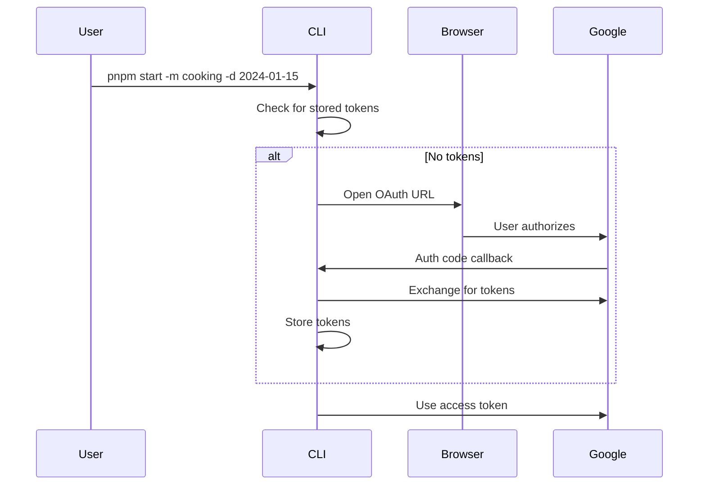

## Overview

CookingAuto can download videos directly from Google Photos using the Picker API. This requires OAuth2 authentication.

## Setup

### 1. Create Google Cloud Project

1. Go to [Google Cloud Console](https://console.cloud.google.com/)
2. Create a new project or select existing
3. Enable these APIs:
   - Google Photos Picker API
   - Google Photos Library API

### 2. Configure OAuth Consent Screen

1. Navigate to **APIs & Services > OAuth consent screen**
2. Choose "External" user type
3. Fill required fields:
   - App name: "CookingAuto"
   - User support email: your email
   - Developer contact: your email
4. Add scopes:
   - `https://www.googleapis.com/auth/photospicker.mediaitems.readonly`

### 3. Create OAuth Credentials

1. Navigate to **APIs & Services > Credentials**
2. Click **Create Credentials > OAuth client ID**
3. Application type: **Desktop app**
4. Name: "CookingAuto Desktop"
5. Download the JSON file
6. Save as `src/auth/credentials.json`

## Credentials Format

```json
{
  "installed": {
    "client_id": "xxxxx.apps.googleusercontent.com",
    "project_id": "your-project",
    "auth_uri": "https://accounts.google.com/o/oauth2/auth",
    "token_uri": "https://oauth2.googleapis.com/token",
    "auth_provider_x509_cert_url": "https://www.googleapis.com/oauth2/v1/certs",
    "client_secret": "xxxxx",
    "redirect_uris": ["http://localhost:3000/callback"]
  }
}
```

## Authentication Flow



## Token Storage

Tokens are stored in `tokens/stored-tokens.json`:

```json
{
  "access_token": "ya29.xxx",
  "refresh_token": "1//xxx",
  "scope": "https://www.googleapis.com/auth/photospicker.mediaitems.readonly",
  "token_type": "Bearer",
  "expiry_date": 1704067200000
}
```

### Token Refresh

Access tokens expire after 1 hour. The library automatically:
1. Detects expired tokens
2. Uses refresh token to get new access token
3. Updates stored tokens

## Picker Flow

### 1. Create Picker Session

```typescript
// src/photos/picker.ts

async function createPickerSession(auth: OAuth2Client): Promise<string> {
  const response = await fetch(
    "https://photospicker.googleapis.com/v1/sessions",
    {
      method: "POST",
      headers: {
        Authorization: `Bearer ${auth.credentials.access_token}`,
        "Content-Type": "application/json",
      },
      body: JSON.stringify({}),
    }
  );
  
  const data = await response.json();
  return data.pickerUri;  // URL to open in browser
}
```

### 2. User Selects Video

The picker opens in the browser. User selects a video from their library.

### 3. Poll for Selection

```typescript
async function pollForSelection(
  auth: OAuth2Client,
  sessionId: string
): Promise<MediaItem[]> {
  while (true) {
    const response = await fetch(
      `https://photospicker.googleapis.com/v1/sessions/${sessionId}`,
      {
        headers: {
          Authorization: `Bearer ${auth.credentials.access_token}`,
        },
      }
    );
    
    const data = await response.json();
    
    if (data.mediaItems?.length > 0) {
      return data.mediaItems;
    }
    
    await sleep(2000);  // Poll every 2 seconds
  }
}
```

### 4. Download Video

```typescript
async function downloadVideo(
  item: MediaItem,
  outputPath: string
): Promise<void> {
  const videoUrl = item.mediaFile.baseUrl + "=dv";  // =dv for video download
  
  const response = await fetch(videoUrl);
  const buffer = await response.arrayBuffer();
  
  await fs.promises.writeFile(outputPath, Buffer.from(buffer));
}
```

## Date Filtering

The `-d` option filters videos by creation date:

```bash
# Videos from January 15, 2024
pnpm start -m cooking -d 2024-01-15
```

<Note>
Date filtering happens client-side after selection. The picker itself doesn't support date filters.
</Note>

## Troubleshooting

<AccordionGroup>
  <Accordion title="OAuth redirect error">
    Ensure `http://localhost:3000/callback` is in your OAuth client's redirect URIs.
  </Accordion>
  
  <Accordion title="API not enabled">
    Enable both Photos Picker API and Photos Library API in Google Cloud Console.
  </Accordion>
  
  <Accordion title="Scope not authorized">
    Re-run OAuth flow. Delete `tokens/stored-tokens.json` and restart.
  </Accordion>
  
  <Accordion title="No videos found">
    The picker shows all media. Ensure you're selecting actual video files, not Live Photos or images.
  </Accordion>
</AccordionGroup>
