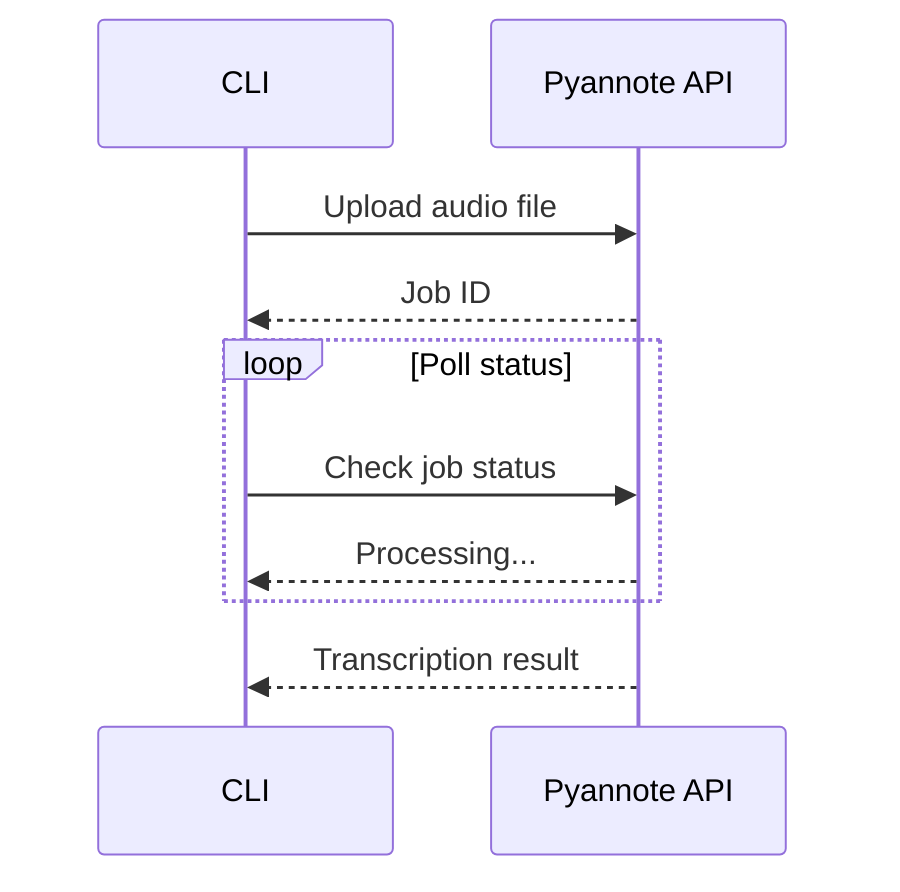

## Overview

CookingAuto supports two transcription engines with speaker diarization:

| Engine | Type | Setup | Best For |
|--------|------|-------|----------|
| WhisperX | Local | Install locally | Privacy, no API costs |
| Pyannote | Cloud | API key | Simple setup, faster |

## WhisperX (Local)

### Installation

```bash
# Install WhisperX
pip install whisperx

# Get HuggingFace token for diarization
# https://huggingface.co/settings/tokens
export HUGGING_FACE_TOKEN=hf_xxx
```

### Requirements

- Python 3.9+
- CUDA-capable GPU (recommended)
- ~8GB VRAM for large-v3 model
- HuggingFace token with access to:
  - `pyannote/speaker-diarization-3.1`
  - `pyannote/segmentation-3.0`

### Configuration

```typescript
// src/processing/transcriber.ts

const WHISPERX_CONFIG = {
  model: "large-v3",
  language: "fr",
  computeType: "float32",
  device: "cuda",  // or "cpu"
};
```

### Usage

```bash
# Default engine is WhisperX
pnpm start -m cooking --audio-file lesson.mp3

# Explicit engine selection
pnpm start -m cooking --audio-file lesson.mp3 --engine whisperx
```

### Output Format

WhisperX outputs JSON with word-level timestamps:

```json
{
  "segments": [
    {
      "start": 0.0,
      "end": 4.5,
      "text": "Bonjour et bienvenue dans ce cours",
      "speaker": "SPEAKER_00",
      "words": [
        { "word": "Bonjour", "start": 0.0, "end": 0.5 },
        { "word": "et", "start": 0.6, "end": 0.7 }
      ]
    }
  ]
}
```

### Subprocess Execution

```typescript
// src/processing/transcriber.ts

async function transcribeWithWhisperX(
  audioPath: string,
  outputDir: string
): Promise<string> {
  const args = [
    audioPath,
    "--model", "large-v3",
    "--language", "fr",
    "--diarize",
    "--output_dir", outputDir,
    "--output_format", "json",
  ];
  
  await spawn("whisperx", args);
  
  return path.join(outputDir, "output.json");
}
```

## Pyannote (Cloud)

### Setup

1. Get API key from [Pyannote](https://www.pyannote.ai/)
2. Set environment variable:

```bash
export PYANNOTE_KEY=your-api-key
```

### Usage

```bash
pnpm start -m cooking --audio-file lesson.mp3 --engine pyannote
```

### API Flow



### Output Format

Pyannote returns turn-level transcription:

```json
{
  "output": {
    "transcription": {
      "turns": [
        {
          "speaker": "speaker_0",
          "words": [
            {
              "word": "Bonjour",
              "start": 0.0,
              "end": 0.5,
              "confidence": 0.98
            }
          ]
        }
      ]
    }
  }
}
```

## Comparison

| Feature | WhisperX | Pyannote |
|---------|----------|----------|
| Cost | Free (local compute) | Pay per minute |
| Speed | Depends on GPU | Fast (cloud) |
| Privacy | Fully local | Audio sent to cloud |
| Setup | Complex (Python, GPU) | Simple (API key) |
| Quality | Excellent | Excellent |
| Languages | 99+ | Many |

## Markdown Output

Both engines are normalized to a common markdown format:

```markdown
**Speaker 1:** Bonjour et bienvenue dans ce cours de cuisine.

**Speaker 2:** Merci chef. Aujourd'hui on va apprendre...

**Speaker 1:** Exactement, on commence par la préparation...
```

This format is then passed to Gemini for card generation.

## Troubleshooting

<AccordionGroup>
  <Accordion title="WhisperX: CUDA out of memory">
    Use a smaller model or CPU:
    ```bash
    export WHISPERX_DEVICE=cpu
    ```
  </Accordion>
  
  <Accordion title="WhisperX: HuggingFace access denied">
    Accept the model licenses on HuggingFace:
    - [pyannote/speaker-diarization-3.1](https://huggingface.co/pyannote/speaker-diarization-3.1)
    - [pyannote/segmentation-3.0](https://huggingface.co/pyannote/segmentation-3.0)
  </Accordion>
  
  <Accordion title="Pyannote: Rate limit">
    The API has rate limits. Wait a few minutes and retry.
  </Accordion>
  
  <Accordion title="Poor diarization">
    Speaker diarization works best with:
    - Clear audio quality
    - Distinct speakers (different voices)
    - Minimal overlapping speech
  </Accordion>
</AccordionGroup>
