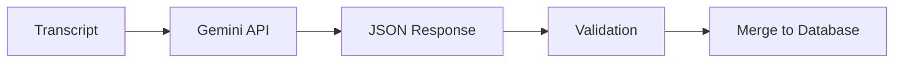

## Overview

The card generator uses Gemini AI to extract educational flashcards from video transcripts:



## Gemini Configuration

```typescript
// src/srs/generator.ts

import { GoogleGenAI } from "@google/genai";

function createClient(): GoogleGenAI {
  const apiKey = process.env.GEMINI_API_KEY;
  if (!apiKey) {
    throw new Error("GEMINI_API_KEY not set");
  }
  return new GoogleGenAI({ apiKey });
}
```

### Model Selection

```bash
# Default model
GEMINI_MODEL=gemini-2.5-flash

# Override in environment
GEMINI_MODEL=gemini-2.0-pro
```

## Prompt Structure

Each mode defines its `cardPrompt`:

```typescript
// src/modes/cooking.ts

export const COOKING_MODE: ModeConfig = {
  name: "cooking",
  cardPrompt: `Tu es un expert en cuisine française. 
Analyse cette transcription et génère des flashcards éducatives.

RÈGLES:
- Cartes en français uniquement
- Question claire et précise (front)
- Réponse concise mais complète (back)
- Tags: "technique", "ingredient", ou "recipe"
- Ignore les connaissances évidentes
- Maximum 20 cartes par transcription

FORMAT DE SORTIE (JSON array):
[
  {
    "front": "Question here?",
    "back": "Answer here.",
    "tags": ["technique"]
  }
]`,
  validTags: ["technique", "ingredient", "recipe"],
  // ...
};
```

## API Call

```typescript
async function generateCards(
  transcript: string,
  modeConfig: ModeConfig
): Promise<CardContent[]> {
  const client = createClient();
  const model = process.env.GEMINI_MODEL ?? "gemini-2.5-flash";
  
  const response = await client.models.generateContent({
    model,
    contents: [
      {
        role: "user",
        parts: [
          { text: modeConfig.cardPrompt },
          { text: `\n\nTRANSCRIPTION:\n${transcript}` },
        ],
      },
    ],
  });
  
  return parseResponse(response.text);
}
```

## Response Parsing

Gemini responses may contain markdown code blocks or curly quotes:

```typescript
function parseResponse(text: string): CardContent[] {
  // Remove markdown code blocks
  let cleaned = text.replace(/```json\n?/g, "").replace(/```\n?/g, "");
  
  // Normalize curly quotes
  cleaned = cleaned
    .replace(/[""]/g, '"')
    .replace(/['']/g, "'");
  
  // Extract JSON array
  const match = cleaned.match(/\[[\s\S]*\]/);
  if (!match) {
    throw new Error("No JSON array found in response");
  }
  
  return JSON.parse(match[0]);
}
```

## Validation

Generated cards are validated against the mode's tag schema:

```typescript
import { Schema } from "effect";

function validateCard(
  card: unknown,
  modeConfig: ModeConfig
): CardContent {
  const schema = Schema.Struct({
    front: Schema.String,
    back: Schema.String,
    tags: Schema.Array(modeConfig.tagSchema),
  });
  
  return Schema.decodeUnknownSync(schema)(card);
}
```

Invalid cards (wrong tags, missing fields) are rejected with errors.

## Rate Limit Handling

The generator includes retry logic for rate limits:

```typescript
async function generateWithRetry(
  transcript: string,
  modeConfig: ModeConfig,
  maxRetries = 5
): Promise<CardContent[]> {
  for (let attempt = 0; attempt < maxRetries; attempt++) {
    try {
      return await generateCards(transcript, modeConfig);
    } catch (error) {
      if (isRateLimitError(error)) {
        const delay = Math.pow(2, attempt) * 1000;  // Exponential backoff
        logger.warn(`Rate limited, retrying in ${delay}ms...`);
        await sleep(delay);
        continue;
      }
      throw error;
    }
  }
  throw new Error(`Failed after ${maxRetries} attempts`);
}
```

## Duplicate Detection

When merging new cards, duplicates are detected by ID:

```typescript
function mergeCards(
  db: CardDatabase,
  newCards: CardContent[]
): { db: CardDatabase; added: number; skipped: number } {
  let added = 0;
  let skipped = 0;
  
  for (const content of newCards) {
    const id = generateCardId(content.front, content.back);
    
    if (db.cards[id]) {
      skipped++;
      continue;
    }
    
    db = addCard(db, createCard(id, content));
    added++;
  }
  
  return { db, added, skipped };
}
```

## Example Generated Cards

From a cooking video transcript:

```json
[
  {
    "front": "Quelle est la technique pour attendrir la viande?",
    "back": "Le marinage dans un acide (citron, vinaigre) pendant 2-24h, ou l'utilisation d'un attendrisseur mécanique.",
    "tags": ["technique"]
  },
  {
    "front": "À quelle température interne la volaille est-elle considérée comme cuite?",
    "back": "75°C (165°F) au point le plus épais de la cuisse.",
    "tags": ["technique"]
  },
  {
    "front": "Qu'est-ce que le fond brun?",
    "back": "Un bouillon concentré fait d'os et de légumes caramélisés, base de nombreuses sauces classiques.",
    "tags": ["ingredient"]
  }
]
```
