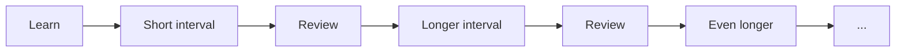
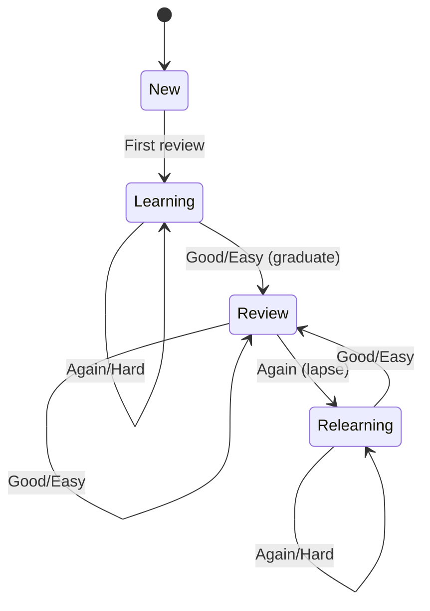

## What is Spaced Repetition?

Spaced repetition is a learning technique that schedules reviews at optimal intervals to maximize retention while minimizing study time. Instead of cramming, you review material just before you'd forget it.



## FSRS Algorithm

CookingAuto uses **FSRS (Free Spaced Repetition Scheduler)** via the [`ts-fsrs`](https://github.com/open-spaced-repetition/ts-fsrs) library. FSRS is a modern, scientifically-backed algorithm that outperforms older systems like SM-2 (used by Anki).

### Key Concepts

| Concept | Description |
|---------|-------------|
| **Stability** | How long (in days) until you have a 90% chance of forgetting |
| **Difficulty** | How inherently hard the card is for you (1-10) |
| **Retrievability** | Current probability of recalling the card |
| **Desired Retention** | Target recall probability (default: 90%) |

### How It Works

1. **Initial Learning**: New cards start with short intervals (minutes to hours)
2. **Graduation**: After successful reviews, cards enter the review phase
3. **Optimal Intervals**: FSRS calculates the next review date to maintain target retention
4. **Adaptive Difficulty**: Card difficulty adjusts based on your performance

## Card States



| State | Description |
|-------|-------------|
| **New** | Never reviewed |
| **Learning** | Initial acquisition phase, short intervals |
| **Review** | Graduated, in normal review rotation |
| **Relearning** | Lapsed card, re-acquiring memory |

## Rating Scale

Each review requires a 1-4 rating:

| Rating | Name | Meaning | Effect |
|--------|------|---------|--------|
| 1 | Again | Completely forgot | Card lapses, enters relearning |
| 2 | Hard | Recalled with difficulty | Shorter interval, increased difficulty |
| 3 | Good | Normal recall | Standard interval progression |
| 4 | Easy | Instant recall | Longer interval, decreased difficulty |

<Tip>
Rate honestly. The algorithm optimizes for your actual performance, not what you wish it was.
</Tip>

## FSRS vs SM-2 (Anki)

| Feature | FSRS | SM-2 |
|---------|------|------|
| Personalization | Adapts to individual memory | Fixed parameters |
| Accuracy | ~85% optimal retention | ~75% |
| Interval calculation | Based on memory model | Based on ease factor |
| Fuzz | Smart randomization | None |

## Configuration

FSRS parameters are set in `src/config.ts`:

```typescript
export const FSRS_CONFIG = {
  enable_fuzz: true,        // Add randomness to intervals
  enable_short_term: true,  // Enable intra-day scheduling
  maximum_interval: 365,    // Max days between reviews
  request_retention: 0.9,   // Target 90% retention
};
```

<Note>
The default 90% retention is a good balance. Higher values (e.g., 95%) significantly increase review load; lower values (e.g., 80%) may lead to excessive forgetting.
</Note>

## Next Steps

<CardGroup cols={2}>
  <Card title="Card Structure" icon="id-card" href="/srs/cards">
    How cards are structured and identified
  </Card>
  <Card title="Scheduling Details" icon="calendar" href="/srs/scheduling">
    Deep dive into interval calculation
  </Card>
</CardGroup>
